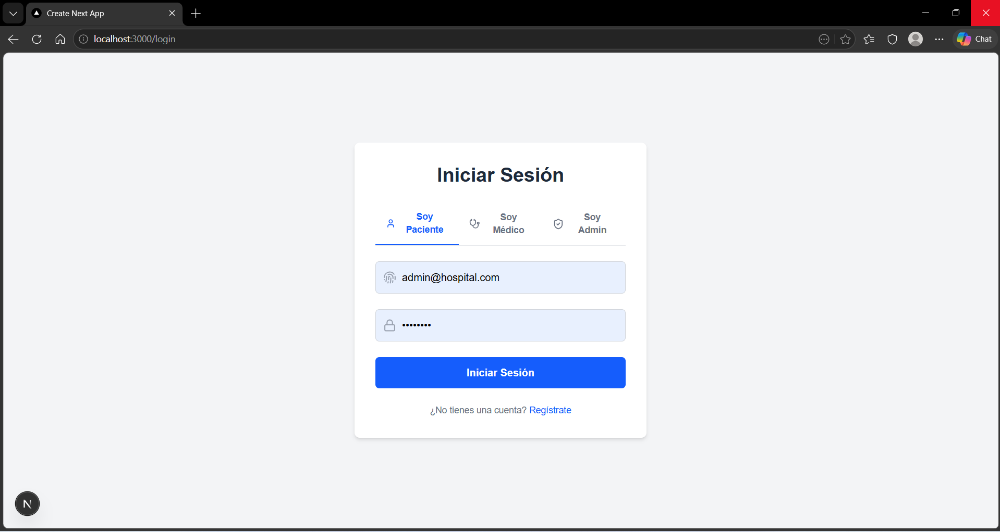
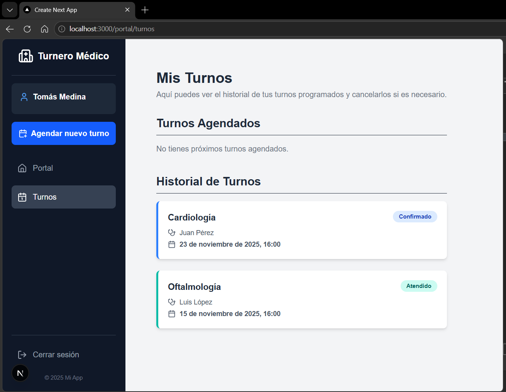
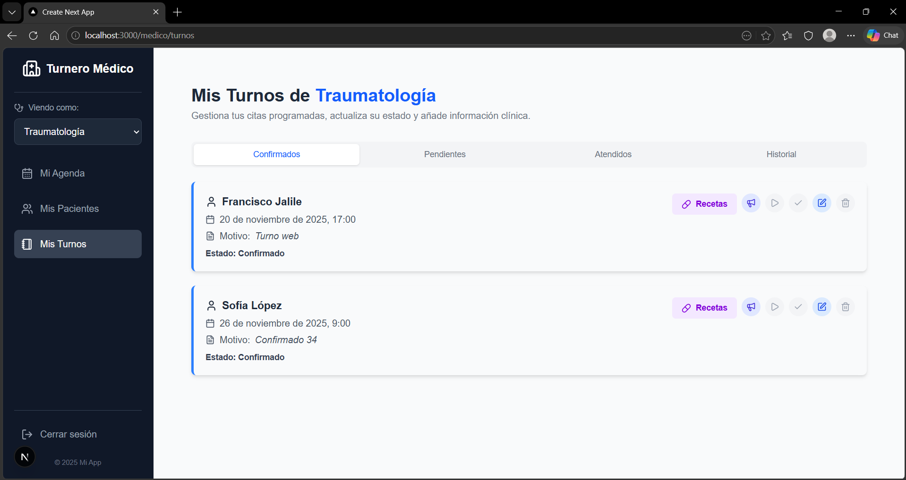
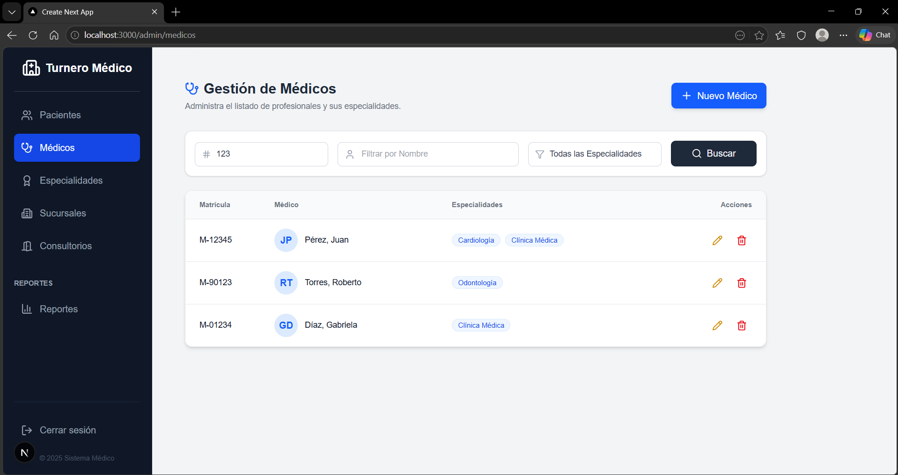
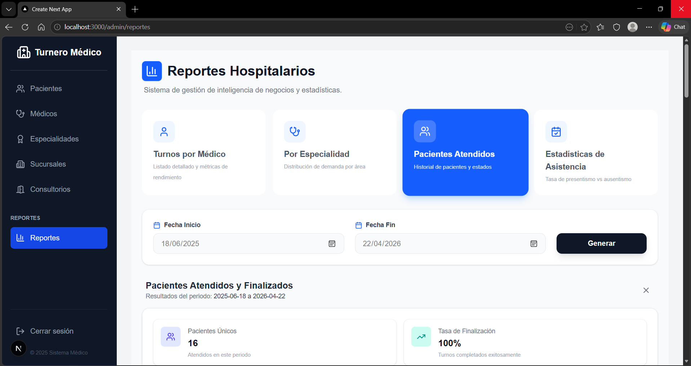
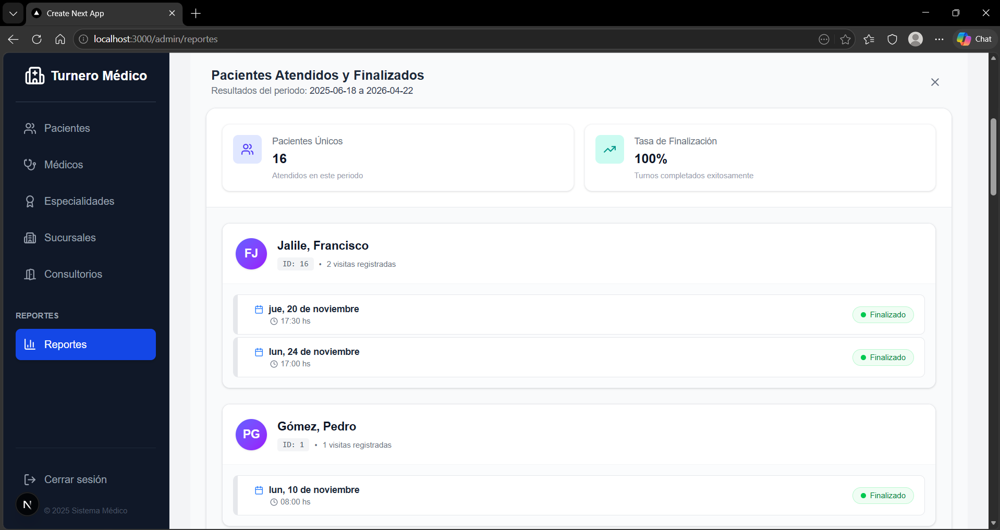
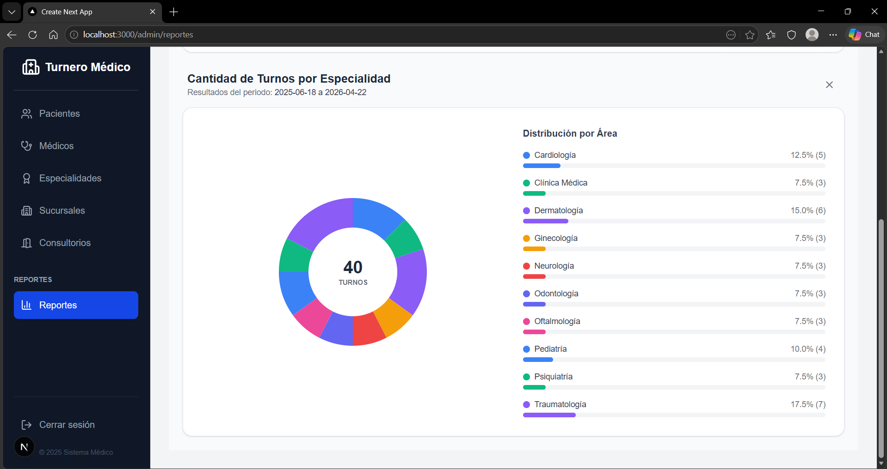

# 🏥 Sistema de Turnos Médicos

Sistema fullstack para la gestión integral de turnos médicos, diseñado para clínicas con múltiples sucursales, especialidades y roles de usuario. Permite a pacientes agendar turnos, a médicos gestionar su agenda y atender consultas, y a administradores controlar todo el sistema.


---

## 📸 Capturas de pantalla

| Login con roles | Portal del paciente |
|:---:|:---:|
|  |  |

| Panel del médico — Gestión de turnos | Panel admin — Gestión de médicos |
|:---:|:---:|
|  |  |

<details>
<summary>📊 Ver reportes y estadísticas</summary>

| Selector de reportes | Reporte de pacientes atendidos |
|:---:|:---:|
|  |  |

| Distribución por especialidad |
|:---:|
|  |

</details>

---

## ✨ Funcionalidades

### Portal del Paciente
- Registro y login con autenticación JWT
- Visualización de turnos disponibles por médico/especialidad
- Agendamiento de turnos con validación de disponibilidad en tiempo real
- Historial de turnos previos

### Panel del Médico
- Gestión de agenda regular y excepcional (bloqueos, guardias extra)
- Flujo completo de atención: Confirmar → Anunciar → Atender → Finalizar
- Emisión de recetas electrónicas con medicamentos
- Generación de recetas en PDF
- Diagnósticos por turno

### Panel de Administración
- ABM completo de pacientes, médicos, especialidades, sucursales y consultorios
- Generación de reportes (por médico, por especialidad, pacientes atendidos)
- Gráficos de asistencia vs. inasistencia
- Gestión de roles y usuarios

### Sistema de Notificaciones
- Recordatorios automáticos por email (24h y 2h antes del turno)
- Ejecución con scheduler en segundo plano (APScheduler)

---

## 🏗️ Arquitectura

```
┌─────────────────────────────────────────────────────────────┐
│                        FRONTEND                             │
│              Next.js 16 + React 19 + TypeScript             │
│                                                             │
│  ┌──────────┐  ┌──────────┐  ┌───────────┐                 │
│  │  Portal   │  │  Médico  │  │   Admin   │  ← Roles       │
│  │ Paciente  │  │  Panel   │  │   Panel   │                 │
│  └──────────┘  └──────────┘  └───────────┘                 │
│           │           │            │                        │
│        Middleware JWT (protección por roles)                 │
└────────────────────────┬────────────────────────────────────┘
                         │ HTTP / REST API
┌────────────────────────┴────────────────────────────────────┐
│                        BACKEND                              │
│                   FastAPI (Python)                           │
│                                                             │
│  ┌─────────────────────────────────────────────────────┐    │
│  │                    API Layer                         │    │
│  │  Routers: auth, turnos, pacientes, médicos,         │    │
│  │  agendas, recetas, reportes, especialidades...      │    │
│  └──────────────────────┬──────────────────────────────┘    │
│                         │                                   │
│  ┌──────────────────────┴──────────────────────────────┐    │
│  │                 Service Layer                        │    │
│  │  TurnoService, AgendaService, ReportService,        │    │
│  │  NotificationService, RecetaService...              │    │
│  └──────────────────────┬──────────────────────────────┘    │
│                         │                                   │
│  ┌──────────────────────┴──────────────────────────────┐    │
│  │               Repository Layer                       │    │
│  │  TurnoRepository, AgendaRepository,                  │    │
│  │  MedicoRepository, PacienteRepository...             │    │
│  └──────────────────────┬──────────────────────────────┘    │
│                         │                                   │
│  ┌──────────────────────┴──────────────────────────────┐    │
│  │             Models (SQLAlchemy ORM)                   │    │
│  │  13+ tablas con relaciones complejas                 │    │
│  └─────────────────────────────────────────────────────┘    │
└─────────────────────────────────────────────────────────────┘
```

---

## 🎨 Patrones de Diseño

### State Pattern — Ciclo de vida de turnos
Los turnos siguen una máquina de estados finita con transiciones validadas. Cada estado es una clase que define las acciones permitidas, y las transiciones inválidas lanzan excepciones.

```
Pendiente → Confirmado → Anunciado → Atendido → Finalizado
    │            │                       │
    └→ Cancelado ←┘                      └→ Ausente
```

### Strategy Pattern — Generación de reportes
Diferentes tipos de reportes (`PorMédico`, `PorEspecialidad`, `Atendidos`, `GráficoAsistencias`) implementan una interfaz común `StrategyReports`. El `ReportService` selecciona la estrategia en runtime vía un `STRATEGY_MAP`.

### Repository Pattern
Cada entidad tiene un repository que encapsula el acceso a datos, desacoplando la lógica de negocio de SQLAlchemy.

### Service Layer
La lógica de negocio (validación de disponibilidad, verificación de FKs, transiciones de estado) está encapsulada en servicios que reciben repositorios inyectados.

### Custom Domain Exceptions
Excepciones semánticas del dominio (`RecursoNoEncontradoError`, `HorarioNoDisponibleError`, `TransicionInvalidaError`) reemplazan las excepciones genéricas, facilitando el manejo de errores en la capa API.

---

## 🗄️ Modelo de Datos

El sistema utiliza un modelo relacional con 13+ tablas, incluyendo:

- **Relaciones many-to-many**: Médicos ↔ Especialidades (tabla intermedia)
- **Claves compuestas**: Turnos (Fecha + Hora + Paciente), Consultorios (Número + Sucursal)
- **Foreign keys configuradas**: con CASCADE, RESTRICT y SET NULL según la semántica de cada relación
- **Entidades principales**: Pacientes, Médicos, Especialidades, Sucursales, Consultorios, Turnos, Estados, Agendas Regulares, Agendas Excepcionales, Recetas, Medicamentos, Drogas, Roles, Usuarios

---

## 🚀 Cómo levantar el proyecto

### Prerrequisitos
- Python 3.11+
- Node.js 18+
- npm

### 1. Clonar el repositorio
```bash
git clone https://github.com/franJ25/Sistema_Gestion_Turnos_Medicos.git
cd Sistema_Gestion_Turnos_Medicos
```

### 2. Backend (FastAPI)
```bash
# Crear y activar entorno virtual
cd app
python -m venv venv
source venv/bin/activate   # Linux/Mac
# venv\Scripts\activate    # Windows

# Instalar dependencias
cd backend
pip install -r requirements.txt

# Configurar variables de entorno
cp .env.example .env
# Editar .env con tus valores (secret key, credenciales SMTP)

# Iniciar el servidor
cd ../..
uvicorn app.backend.main:app --reload
```
El backend estará disponible en `http://localhost:8000` y la documentación Swagger en `http://localhost:8000/docs`.

### 3. Frontend (Next.js)
```bash
cd app/frontend

# Instalar dependencias
npm install

# Configurar variables de entorno
cp .env.example .env.local
# Editar .env.local con tus valores

# Iniciar el servidor de desarrollo
npm run dev
```
El frontend estará disponible en `http://localhost:3000`.

### 4. Datos de prueba (opcional)
```bash
# Desde la raíz del proyecto
python scripts/seed_data.py
```
Esto crea usuarios de prueba con las siguientes credenciales:

| Rol | Email | Contraseña |
|-----|-------|------------|
| Admin | admin@hospital.com | admin123 |
| Médico | juan.perez@hospital.com | medico123 |
| Paciente | pedro.gomez@email.com | paciente123 |

### 5. Notificaciones por email (opcional)
```bash
python scripts/scheduler_main.py
```
Ejecuta un job en segundo plano que envía recordatorios por email.

---

## 📋 Roadmap

- [ ] Tests unitarios y de integración
- [ ] Módulo de historial clínico detallado
- [ ] Dashboard con gráficos interactivos en el frontend
- [ ] Containerización con Docker
- [ ] Deploy en producción (Railway / Vercel)
- [ ] Sistema de turnos recurrentes

---

## 🧰 Stack Tecnológico

| Capa | Tecnología |
|------|-----------|
| **Frontend** | Next.js 16, React 19, TypeScript, TailwindCSS v4 |
| **Backend** | FastAPI, Python 3.11+, SQLAlchemy 2.0, Pydantic v2 |
| **Base de datos** | SQLite (desarrollo) |
| **Autenticación** | JWT (python-jose + jose), bcrypt |
| **Notificaciones** | smtplib + APScheduler |
| **PDF** | ReportLab |
| **Iconos** | Lucide React |

---

## 👥 Autores

- Guillermina Paola Contigiani
- Francisco Jalile
- Fabrizzio Alejandro Leonetti
- Yanella Esmeralda Odar Alejos
- Laureano Suppo